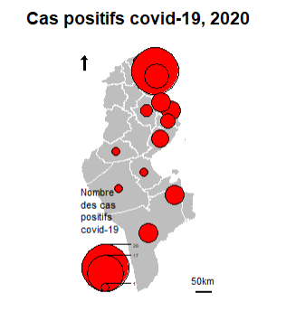
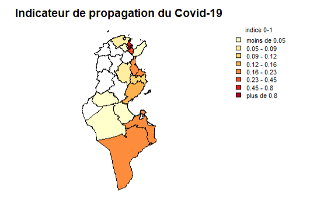

# Projet Analyse de Donnees

## Etude de cas sur la propagation du covid-19 dans la republique Tunisienne

Ce projet est fait dans le but d'etudier la propagation du virus covid-19 dans la republique Tunisienne en utilisant R et d'afficher les resultats sur une figure cartographique

## Etapes de developpement

1. Charger la carte depuis un ensemble des fichiers prj, dbf, shp, shx.
1. Charger les donnees depuis un fichier csv.
1. Netoyer les donnees.
1. Plotter les donnees sur une carte en utilisant des cercles pour les representer.
1. Plotter les donnees sur une carte en utilisant des differentes gradients de la meme couleur pour les representer.

## Dependances

`install.packages("maptools")`  
`install.packages("sp")`  
`install.packages("shapefiles")`  
`install.packages("classInt")`  
`install.packages("RColorBrewer")`  

